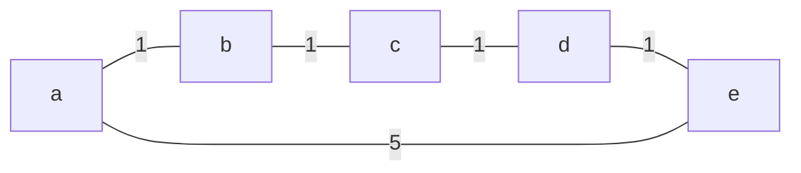
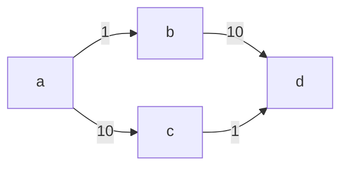

# kotlin-graphs

Directed, undirected, weighted and unweighted graph algorithms for Kotlin Multiplatform.

```kotlin
val graph = buildUndirectedNetwork {
  val (v1, v2, v3) = addVertices()
  addEdge(v1 edgeTo v3, 4)
  addEdge(v1 edgeTo v2, 1)
  addEdge(v2 edgeTo v3, 2)
}

val path = graph.shortestPathDijkstra(graph[0], graph[3])

println(path) // [v1, v2, v3]

```

## Download

```groovy
repositories {
    mavenCentral()
}

dependencies {
    implementation "io.github.alexandrepiveteau:kotlin-graphs:0.5.0"
}

```

<details>
<summary>Snapshots of the development version are available in Sonatype's snapshots repository.</summary>
<p>

```groovy
repositories {
    maven {
        url "https://s01.oss.sonatype.org/content/repositories/snapshots/"
    }
}

dependencies {
    implementation "io.github.alexandrepiveteau:kotlin-graphs:0.6.0-SNAPSHOT"
}
```

</p>
</details>

## Features

+ Written in uncomplicated Kotlin
+ Supports various graph types with a type-safe API
    - Directed and undirected
    - Weighted and unweighted
+ Reasonably fast and avoids auto-boxing on JVM
+ Works on Kotlin/JVM, Kotlin/JS and Kotlin/Native

> :warning: This library is still in heavy development, and you should expect
> the following:
>
> + The API is not stable, and may change at any time.
> + The algorithms are not well tested, and may contain correctness bugs.
> + The algorithms are not optimized, and may have performance issues.

## Usage

A `Graph` is a collection of `Vertex`, connected by `Edge`s (for undirected graphs) or `Arc`s (for directed graphs).
Each arc or edge may have an `Int` weight, in which case the graph is a `Network`.

```kotlin
val undirectedGraph = buildUndirectedGraph {
  val (a, b, c) = addVertices() // Insert multiple vertices at once ...
  val d = addVertex() // ... or just one at a time.

  val e1 = a edgeTo b // Create an edge between two vertices ...
  addEdge(e1) // ... and insert it in the graph. Networks support weighted edges and arcs.
}
val directedGraph = buildDirectedGraph { /* ... */}
val undirectedNetwork = buildUndirectedNetwork { /* ... */}
val directedNetwork = buildDirectedNetwork { /* ... */}

```

You can then iterate over the vertices of the network.

```kotlin
directedGraph.forEachVertex { v -> println(v) }

```

Additionally, the edges or arcs of the graph can be iterated over.

```kotlin
undirectedGraph.forEachEdge { (u, v) -> println("$u <-> $v") }
```

Networks also provide the weight of their edges or arcs.

```kotlin
directedNetwork.forEachArc { (from, to), weight -> println("$from -> $to : $weight") }

```

## Examples

<details>
<summary>Shortest path using Shortest Path Faster Algorithm</summary>
<p>



```kotlin
val graph = buildUndirectedNetwork {
  val (a, b, c, d, e) = addVertices()
  addEdge(a edgeTo b, 1)
  addEdge(b edgeTo c, 1)
  addEdge(c edgeTo d, 1)
  addEdge(d edgeTo e, 1)
  addEdge(e edgeTo a, 5)
}
val expected = buildDirectedNetwork {
  val (a, b, c, d, e) = addVertices()
  addArc(a arcTo b, 1)
  addArc(b arcTo c, 1)
  addArc(c arcTo d, 1)
  addArc(d arcTo e, 1)
}

val spfa = graph.shortestPathFasterAlgorithm(graph[0])

// Checks that the graphs have the same structure and the same weights.
assertEqualsGraph(expected, spfa)

```

</p>
</details>

<details>
<summary>Maximum flow using the Ford-Fulkerson / Edmonds-Karp algorithm</summary>
<p>



```kotlin
val capacities = buildDirectedNetwork {
  val (a, b, c, d) = addVertices()
  addArc(a arcTo b, 1)
  addArc(a arcTo c, 10)
  addArc(b arcTo d, 10)
  addArc(c arcTo d, 1)
}
val expected = buildDirectedNetwork {
  val (a, b, c, d) = addVertices()
  addArc(a arcTo b, 1)
  addArc(a arcTo c, 1)
  addArc(b arcTo d, 1)
  addArc(c arcTo d, 1)
}

val a = capacities[0]
val d = capacities[3]
val flow = capacities.maxFlowEdmondsKarp(a, d)

// Checks that the graphs have the same structure and the same weights.
assertEqualsGraph(expected, flow)

```

</p>
</details>

## Contributing

:unicorn: Contributions are welcomed and appreciated! In particular, the following contributions would be very useful:

+ Adding some tests for the current algorithms.
+ Benchmarking the implementation against comparable libraries.
+ Improving the documentation.

If you're interested in contributing, please take a look at the list of [open issues](https://github.com/alexandrepiveteau/kotlin-graphs/issues)!
