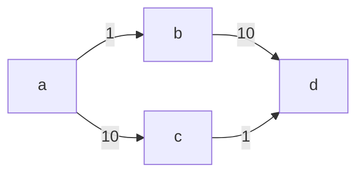

# kotlin-graphs

[](https://github.com/alexandrepiveteau/kotlin-graphs/actions/workflows/tests.yml)

Model directed, undirected, weighted and unweighted graphs and perform
computations on them in Kotlin multiplatform.

## Features

+ Written in uncomplicated Kotlin
+ Supports various graph types with a type-safe API
    - Directed and undirected
    - Weighted and unweighted
+ Reasonably fast and avoids auto-boxing on JVM
+ Works on Kotlin/JVM, Kotlin/JS and Kotlin/Native

## Installation

### Gradle

```groovy
repositories {
    mavenCentral()
}

dependencies {
    implementation "io.github.alexandrepiveteau:kotlin-graphs:$version"
}

```

## Usage

### Maximum flow using the Ford-Fulkerson / Edmonds-Karp algorithm



```kotlin
val capacities = buildDirectedNetwork {
  val (a, b, c, d) = addVertices()
  addArc(a arcTo b, 1)
  addArc(a arcTo c, 10)
  addArc(b arcTo d, 10)
  addArc(c arcTo d, 1)
}
val expected = buildDirectedNetwork {
  val (a, b, c, d) = addVertices()
  addArc(a arcTo b, 1)
  addArc(a arcTo c, 1)
  addArc(b arcTo d, 1)
  addArc(c arcTo d, 1)
}

val a = capacities[0]
val d = capacities[3]
val flow = capacities.maxFlowEdmondsKarp(a, d)

// Checks that the graphs have the same structure and the same weights.
assertEqualsGraph(expected, flow)

```
