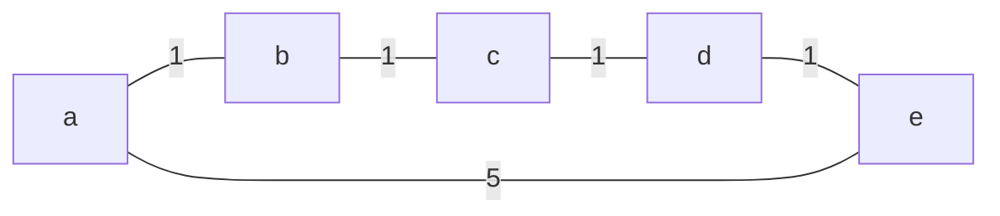
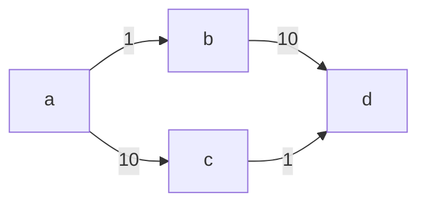

# kotlin-graphs

[](https://github.com/alexandrepiveteau/kotlin-graphs/actions/workflows/build.yml)
[](https://search.maven.org/search?q=io.github.alexandrepiveteau.kotlin-graphs)
[](#installation)

Model directed, undirected, weighted and unweighted graphs and perform
computations on them in Kotlin multiplatform.

> :warning: This library is still in heavy development, and you should expect
> the following:
>
> + The API is not stable, and may change at any time.
> + The algorithms are not well tested, and may contain correctness bugs.
> + The algorithms are not optimized, and may have performance issues.

## Features

+ Written in uncomplicated Kotlin
+ Supports various graph types with a type-safe API
    - Directed and undirected
    - Weighted and unweighted
+ Reasonably fast and avoids auto-boxing on JVM
+ Works on Kotlin/JVM, Kotlin/JS and Kotlin/Native

> :unicorn: Contributions are welcome and appreciated! In particular, the
> following contributions would be very useful:
>
> + Adding some tests for the current algorithms.
> + Benchmarking the implementation against comparable libraries.
> + Improving the documentation.
>
> If you're interested in contributing, please take a look at the list of
> [open issues](https://github.com/alexandrepiveteau/kotlin-graphs/issues)!

## Installation

### Gradle

```groovy
repositories {
    mavenCentral()
}

dependencies {
    implementation "io.github.alexandrepiveteau:kotlin-graphs:0.1.1"
}

```

## Usage

### Shortest path using Shortest Path Faster Algorithm



```kotlin
val graph = buildUndirectedNetwork {
  val (a, b, c, d, e) = addVertices()
  addEdge(a edgeTo b, 1)
  addEdge(b edgeTo c, 1)
  addEdge(c edgeTo d, 1)
  addEdge(d edgeTo e, 1)
  addEdge(e edgeTo a, 5)
}
val expected = buildDirectedNetwork {
  val (a, b, c, d, e) = addVertices()
  addArc(a arcTo b, 1)
  addArc(b arcTo c, 1)
  addArc(c arcTo d, 1)
  addArc(d arcTo e, 1)
}

val spfa = graph.shortestPathFasterAlgorithm(graph[0])

// Checks that the graphs have the same structure and the same weights.
assertEqualsGraph(expected, spfa)

```

### Maximum flow using the Ford-Fulkerson / Edmonds-Karp algorithm



```kotlin
val capacities = buildDirectedNetwork {
  val (a, b, c, d) = addVertices()
  addArc(a arcTo b, 1)
  addArc(a arcTo c, 10)
  addArc(b arcTo d, 10)
  addArc(c arcTo d, 1)
}
val expected = buildDirectedNetwork {
  val (a, b, c, d) = addVertices()
  addArc(a arcTo b, 1)
  addArc(a arcTo c, 1)
  addArc(b arcTo d, 1)
  addArc(c arcTo d, 1)
}

val a = capacities[0]
val d = capacities[3]
val flow = capacities.maxFlowEdmondsKarp(a, d)

// Checks that the graphs have the same structure and the same weights.
assertEqualsGraph(expected, flow)

```
